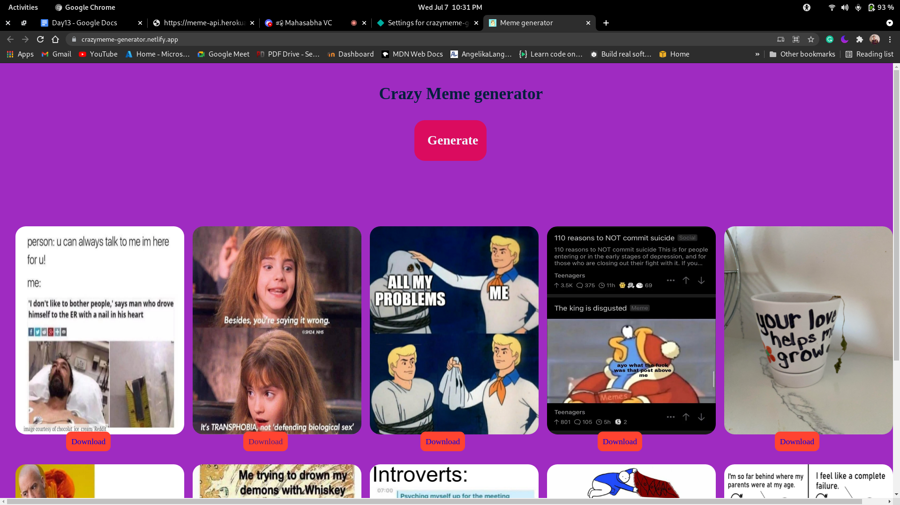

<!-- Please update value in the {}  -->

<h1 align="center">Meme generator</h1>

  <h3>
    <a href="https://crazymeme-generator.netlify.app/">
      Demo
    </a>
     | 
    <a href="https://github.com/majjikishore007/memesgenerator">
      SourceCode
    </a>
  </h3>

<!-- TABLE OF CONTENTS -->

## Table of Contents

- [Overview](#overview)
  - [Built With](#built-with)

<!-- OVERVIEW -->

## Overview

### Built With

<!-- This section should list any major frameworks that you built your project using. Here are a few examples.-->

- Html
- Html 
- css

